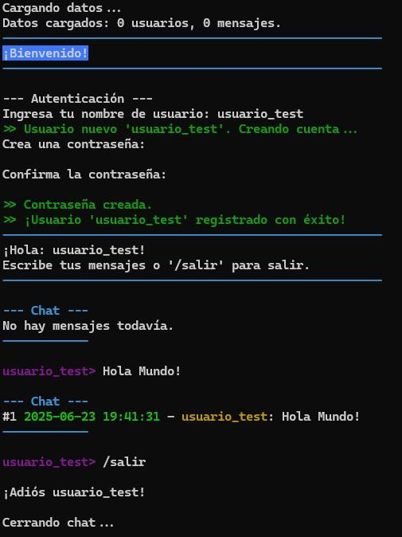

# Chat en Consola con Ruby

Este proyecto es una aplicación de chat básica en consola desarrollada en Ruby. Su objetivo principal fue **aplicar y consolidar mis conocimientos en el lenguaje**, enfocándose en la Programación Orientada a Objetos (POO), el manejo de datos con SQLite (previamente JSON) y la modularización del código.

### Conceptos Clave de Ruby Demostrados

A lo largo de este proyecto, he puesto en práctica y profundizado mi comprensión en:

* **Programación Orientada a Objetos (POO):**
    * Diseño y uso de clases (`ChatApp`, `Usuario`, `Mensaje`, `AlmacenamientoDB`, `Temas`) para modelar entidades y funcionalidades.
    * Manejo de estado de objetos con variables de instancia (`@`).
    * Control de acceso a atributos con `attr_reader` y `attr_accessor`.
    * Implementación de métodos de instancia y uso de convenciones Ruby (`?` para booleanos, `!` para modificación de estado).
    * Encapsulamiento mediante métodos `private`.

* **Manejo de Datos y Persistencia (SQLite3):**
    * Integración con bases de datos relacionales usando la gema `sqlite3`.
    * Creación de esquemas de tablas con SQL y gestión de claves foráneas (`FOREIGN KEY`, `ON DELETE CASCADE`).
    * Mapeo bidireccional entre datos de la base de datos y objetos Ruby.
    * Manejo robusto de excepciones de base de datos.

* **Control de Flujo y Estructuras de Datos:**
    * Uso efectivo de condicionales (`if/else`, `unless`), bucles (`loop`, `each`) y `case` statements para la lógica de la aplicación y el procesamiento de comandos.
    * Manipulación de colecciones (`Arrays`, `Hashes`) con métodos como `find` y `reject!`.

* **Interacción con el Usuario y Seguridad Básica:**
    * Gestión de entrada/salida en consola (`gets`, `puts`).
    * Uso de `io/console` y `STDIN.noecho` para ocultar la entrada de contraseñas, mejorando la seguridad.
    * Procesamiento de comandos de usuario con validación de permisos.

* **Modularización y Buenas Prácticas:**
    * Organización del código en archivos y módulos (`require_relative`, `module Temas`) para promover la reutilización y la legibilidad.
    * Uso de constantes (`.freeze`) para valores inmutables.

### Cómo Ejecutar el Proyecto

Para probar esta aplicación:

1.  **Clona el repositorio:**
    ```bash
    git clone https://github.com/tu_usuario/tu_repo.git
    cd tu_repo
    ```
2.  **Instala las dependencias (Gems):**
    Asegúrate de tener [Bundler](https://bundler.io/) instalado (`gem install bundler`). Luego, en la raíz del proyecto:
    ```bash
    bundle install
    ```
3.  **Ejecuta la aplicación:**
    ```bash
    ruby main.rb
    ```
    Podrás registrarte o iniciar sesión. Prueba los comandos de administrador (`/borrar`, `/bloquear`, `/desbloquear`) configurando un usuario como `es_admin = 1` en la base de datos `db/chat_app.sqlite3` (ej. con [DB Browser for SQLite](https://sqlitebrowser.org/)).

### Muestra de programa



### Reflexiones y Próximos Pasos

Este proyecto fue una valiosa experiencia para consolidar mis fundamentos en Ruby, especialmente en POO y persistencia de datos.
Como próximo paso, me gustaría explorar Rails y poder adaptar lo aprendido a este framework.
